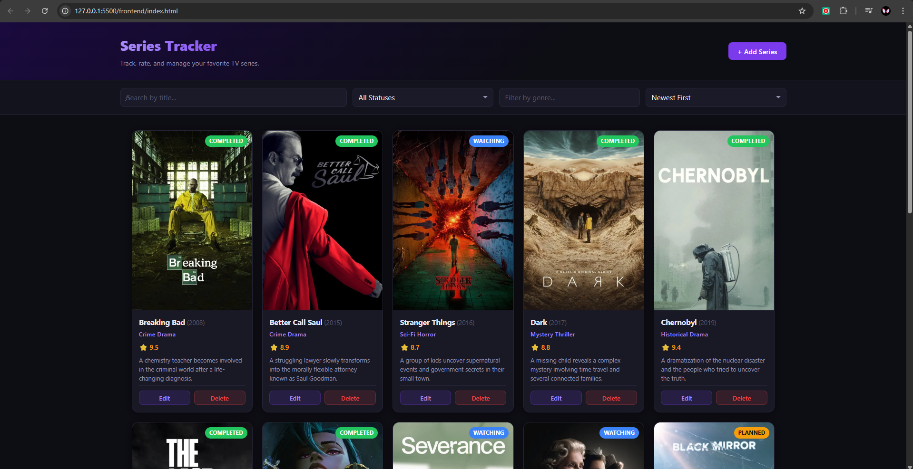

# 🎬 Series Tracker — Frontend


Frontend de **Series Tracker**, una aplicación web de una sola página desarrollada con **HTML**, **CSS** y **JavaScript vanilla**.

La aplicación permite registrar, visualizar, buscar, filtrar, editar y eliminar series de televisión. El frontend consume la API REST del backend usando únicamente `fetch()` nativo, sin frameworks ni librerías externas.

---

## 📌 Tabla de contenido

* [🚀 Stack tecnológico](#-stack-tecnológico)
* [🧪 Ejecución local](#-ejecución-local)
* [⚙️ Configuración de la API](#️-configuración-de-la-api)
* [✨ Funcionalidades](#-funcionalidades)
* [☁️ Despliegue en Render](#️-despliegue-en-render)
* [📁 Estructura del proyecto](#-estructura-del-proyecto)
* [🖼️ Captura de la aplicación](#️-captura-de-la-aplicación)
* [🏆 Challenges implementados](#-challenges-implementados)
* [💭 Reflexión](#-reflexión)
* [🔗 Relacionado](#-relacionado)

---

## 🚀 Stack tecnológico

| Capa          | Tecnología                                        |
| ------------- | ------------------------------------------------- |
| 🧱 Estructura | HTML5 semántico                                   |
| 🎨 Estilos    | CSS3 con variables personalizadas, grid y flexbox |
| 🧠 Lógica     | JavaScript vanilla ES2020+, sin frameworks        |
| 🌐 HTTP       | API nativa `fetch()`                              |
| ☁️ Deploy     | Render Static Site                                |

---

## 🧪 Ejecución local

Este frontend no necesita proceso de build. Solo se deben servir los archivos mediante HTTP.

> [!IMPORTANT]
> Antes de abrir el frontend, el backend debe estar ejecutándose en:
>
> ```txt
> http://localhost:3000
> ```

### Opción 1 — VS Code Live Server

1. Instalar la extensión [Live Server](https://marketplace.visualstudio.com/items?itemName=ritwickdey.LiveServer).
2. Abrir la carpeta `frontend/` en VS Code.
3. Hacer clic derecho sobre `index.html`.
4. Seleccionar **Open with Live Server**.
5. La aplicación se abre normalmente en:

```txt id="2f8wqc"
http://127.0.0.1:5500
```

### Opción 2 — Python

```bash id="f3840w"
cd frontend
python -m http.server 5500
```

Luego abrir:

```txt id="kh2mlo"
http://localhost:5500
```

### Opción 3 — Node.js con `serve`

```bash id="jhipdz"
npx serve frontend -l 5500
```

---

## ⚙️ Configuración de la API

La URL base de la API se define en el archivo **`config.js`**:

```js id="d8wpib"
const API_BASE_URL = "http://localhost:3000";
```

### Desarrollo local

Para desarrollo local, se puede dejar el valor por defecto:

```txt id="cqit3f"
http://localhost:3000
```

### Producción en Render

Después de desplegar el backend en Render, se debe actualizar `config.js` con la URL pública del backend:

```js id="sg8mox"
const API_BASE_URL = "https://series-tracker-backend.onrender.com";
```

La URL debe reemplazarse por la URL real del servicio backend desplegado en Render.

> [!NOTE]
> No se debe abrir el archivo `index.html` directamente como `file:///`, porque eso puede provocar errores de CORS.
> El frontend debe abrirse usando Live Server, Python HTTP Server, `serve` o el deploy de Render.

---

## ✨ Funcionalidades

| Funcionalidad      | Descripción                                              |
| ------------------ | -------------------------------------------------------- |
| ✅ CRUD             | Crear, leer, actualizar y eliminar series                |
| 🔎 Búsqueda        | Búsqueda por título en tiempo real con debounce          |
| 🧩 Filtros         | Filtrado por estado y género                             |
| ↕️ Ordenamiento    | Ordenamiento por fecha, rating, título o año de estreno  |
| 📄 Paginación      | Navegación entre páginas de resultados                   |
| 🖼️ Imágenes       | Imagen de póster mostrada en cada tarjeta                |
| 📱 Responsive      | Adaptación a escritorio, tablet y móvil                  |
| ⏳ Estado de carga  | Indicador visual mientras se cargan los datos            |
| 📭 Estado vacío    | Mensaje amigable cuando no hay resultados                |
| ⚠️ Estado de error | Mensajes claros cuando ocurre un error con la API        |
| 🔔 Toasts          | Notificaciones después de crear, actualizar o eliminar   |
| ✏️ Modo edición    | Formulario precargado para editar con opción de cancelar |
| 🗑️ Confirmación   | Confirmación antes de eliminar una serie                 |

---

## ☁️ Despliegue en Render

Para desplegar este frontend en Render:

1. Subir la carpeta `frontend/` o el repositorio completo a GitHub.
2. Entrar a [Render](https://render.com).
3. Crear un nuevo servicio desde **New** → **Static Site**.
4. Conectar el repositorio de GitHub.
5. Configurar el servicio con los siguientes valores:

| Configuración     | Valor       |
| ----------------- | ----------- |
| Root Directory    | `frontend`  |
| Build Command     | Dejar vacío |
| Publish Directory | `.`         |

6. Antes del despliegue, actualizar `config.js` con la URL pública del backend en Render:

```js id="cwfrsu"
const API_BASE_URL = "https://series-tracker-backend.onrender.com";
```

7. Ejecutar el despliegue con **Deploy**.

---

## 📁 Estructura del proyecto

```txt id="8g3ivg"
frontend/
├── index.html    — Estructura HTML y marcado semántico
├── styles.css    — Estilos de la aplicación, tema oscuro y diseño responsive
├── config.js     — Configuración de la URL base de la API
├── app.js        — Lógica de la aplicación: fetch, renderizado y CRUD
├── assets/       — Capturas o recursos visuales del README
└── README.md
```

---

## 🖼️ Captura de la aplicación

La siguiente captura muestra la interfaz principal de **Series Tracker** funcionando correctamente, cargando las series desde el backend y mostrando tarjetas con imagen, título, género, estado, rating y año de estreno.

<p align="center">
  
</p>

---

## 🏆 Challenges implementados

| Estado | Challenge                                                           |
| ------ | ------------------------------------------------------------------- |
| ✅      | Interfaz desarrollada únicamente con HTML, CSS y JavaScript vanilla |
| ✅      | Consumo de la API REST usando `fetch()` nativo                      |
| ✅      | Listado de series en tarjetas visuales                              |
| ✅      | Formulario para crear nuevas series                                 |
| ✅      | Modo edición para actualizar series existentes                      |
| ✅      | Eliminación de series con confirmación previa                       |
| ✅      | Búsqueda por título en tiempo real                                  |
| ✅      | Filtrado por estado                                                 |
| ✅      | Filtrado por género                                                 |
| ✅      | Ordenamiento por fecha, rating, título y año de estreno             |
| ✅      | Paginación de resultados                                            |
| ✅      | Soporte visual para imágenes usando `image_url`                     |
| ✅      | Estados de carga mientras se obtienen datos                         |
| ✅      | Mensajes de error amigables cuando falla la API                     |
| ✅      | Estado vacío cuando no hay resultados                               |
| ✅      | Notificaciones tipo toast después de crear, editar o eliminar       |
| ✅      | Diseño responsive para escritorio, tablet y móvil                   |

---

## 💭 Reflexión

Para el frontend se utilizó **HTML, CSS y JavaScript vanilla**, sin frameworks ni librerías externas. Esta decisión permitió trabajar directamente con el DOM, los eventos del navegador, los formularios y las peticiones HTTP mediante `fetch()`.

Uno de los principales retos fue organizar la lógica de la aplicación sin herramientas como React, Vue, Angular o Axios. Fue necesario manejar manualmente el estado de la interfaz, el modo de edición, la recarga de datos, la búsqueda, los filtros, la paginación, los mensajes de error y las notificaciones.

También fue importante separar la URL del backend en un archivo `config.js`, ya que esto facilita cambiar entre el entorno local y el entorno de producción en Render. Además, se evitó abrir el archivo como `file:///`, porque eso puede provocar errores de CORS. Por esa razón, el frontend debe servirse usando Live Server, Python HTTP Server, `serve` o Render.

Sí volvería a usar JavaScript vanilla para proyectos pequeños o tareas donde se busca comprender mejor cómo funciona la web sin depender de frameworks. Sin embargo, para una aplicación más grande probablemente utilizaría un framework como React, ya que facilita el manejo de componentes, estados y actualizaciones de interfaz. En este caso, JavaScript vanilla fue una buena elección porque era un requisito de la tarea y ayudó a entender mejor la comunicación entre frontend, backend y base de datos.

---

## 🔗 Relacionado

* 🧠 Repositorio del backend: [web-proyecto1-frontend](https://github.com/esteban-dlp/web-proyecto1-backend.git)
* 📡 API del backend: *[agregar enlace]*
* 📘 Documentación Swagger: *[agregar enlace]/api-docs*

---

<p align="center">
  Desarrollado como proyecto full stack para el curso de Desarrollo Web.
</p>
